# Test service
## Service overview
_Show all of components in the service and describe the ways they connect to each others_

## Data model
_Show data structure and relations between them in the service_

## Sequence diagram
_Describe business logic flows in each of APIs, workers... in the service_
1. [Begin write sequence diagram from here](md/Begin_write_sequence_diagram_from_here.sequence.md)

