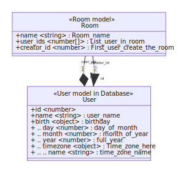

# Test service
## Overview
_List all of components in the application & describe the ways they comunicate to each others_

## Components & Actions
_Flows & Actions details between the application and others components_

## Data model
_Data structure and relations between them in the service_

## Sequence diagram
_Describe business logic flows in each of APIs, workers... in the service_
1. [Begin write sequence diagram from here](api_sequence_diagram/Begin_write_sequence_diagram_from_here.md)

