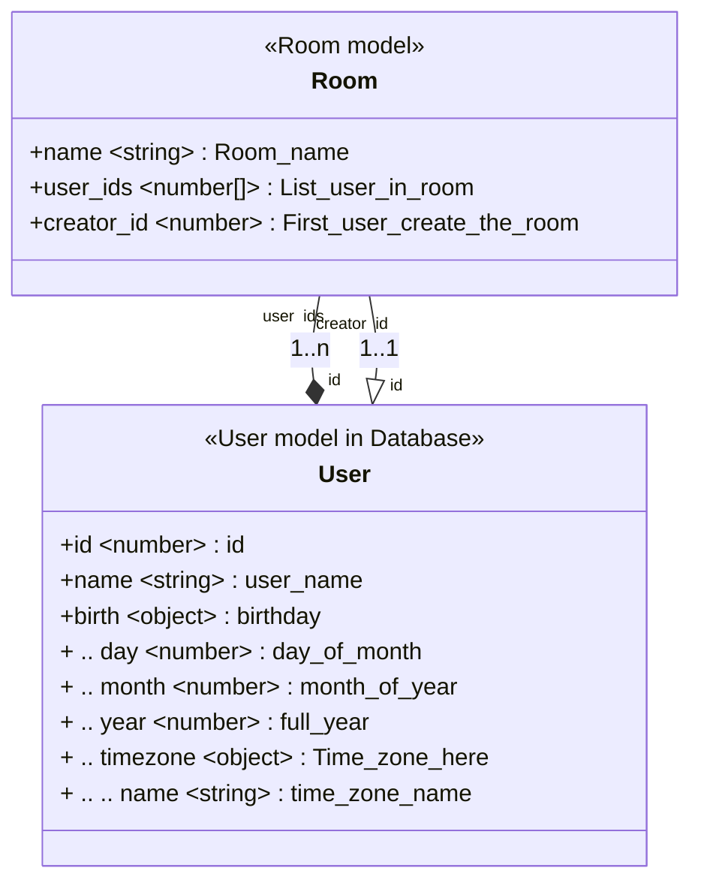

## Data model
_Show data structure and relations between them in the service_

```mermaid
classDiagram
  class User {
  <<User model in Database>>
    +id ~number~ : id
    +name ~string~ : user_name
    +birth ~object~ : birthday
      + .. day ~number~ : day_of_month
      + .. month ~number~ : month_of_year
      + .. year ~number~ : full_year
      + .. timezone ~object~ : Time_zone_here
        + ..  .. name ~string~ : time_zone_name
  }

  class Room {
  <<Room model>>
    +name ~string~ : Room_name
    +user_ids ~number[]~ : List_user_in_room
    +creator_id ~number~ : First_user_create_the_room
  }
Room "user_ids" --* "id" User: 1..n
Room "creator_id" --|> "id" User: 1..1
```