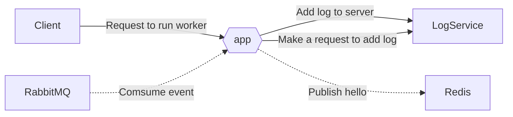

## Service overview
_Show all of components in the service and describe the ways they connect to each others_

```mermaid
graph LR
Client
app{{app}}
LogService
Redis
RabbitMQ
Client -->|Request to run worker| app
app -->|Add log to server| LogService
app -->|Make a request to add log| LogService
app -.->|Publish hello| Redis
RabbitMQ -.->|Comsume event| app
```